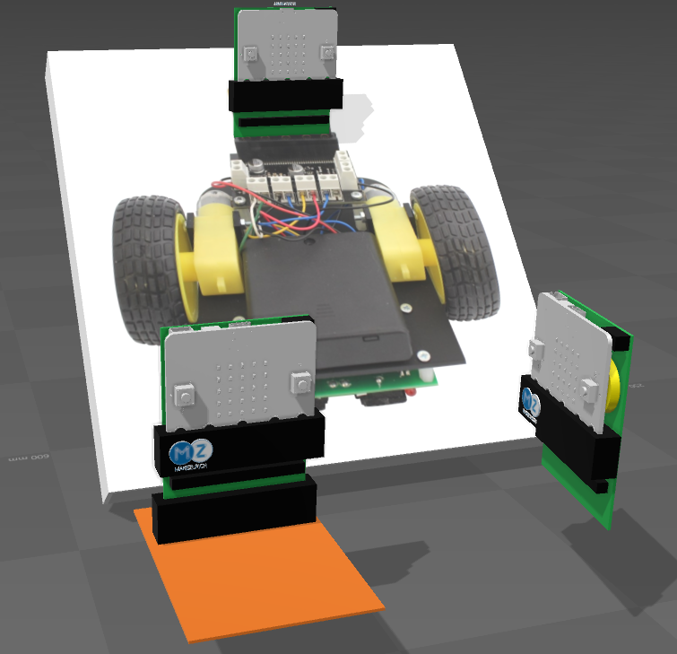
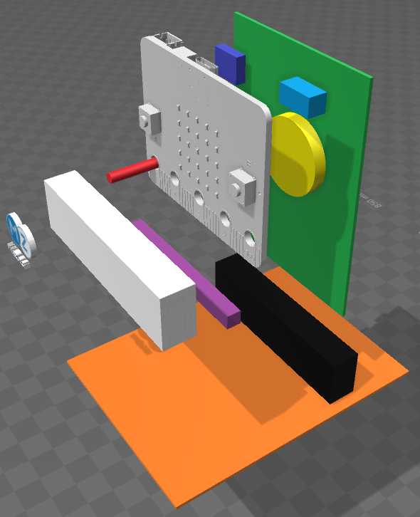
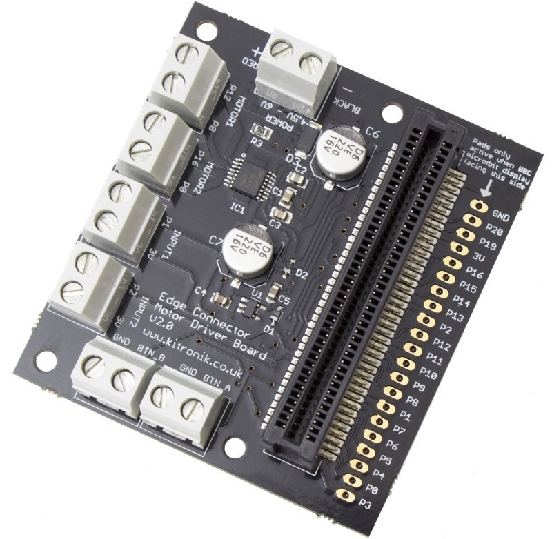

# baggybit

## Parts

The exploded view shows some of the main components
- The Green PCB
 - see below
- The Orange PCB
 - see below
- The yellow coin battery
 - should be replaceable without removing the micro:bit 
- The blue 3.5 audi connector
 - p0 left p1 right and p2 mic
 - The connections on the green pcb should allow for disablement
- The indigo micro sd flash holder
 - connected to SPI and a digital i/o /SS
- The white 90 degree connector
 - if not populated, use red bolt/nut/spacer
- The purple jumper connector(s)
 - to allow rerouting to other pins back and front 
- The badge
 - an example of the usage as a badge with place for a name to the right of logo

### The green PCB
The green PCB has hopefully an area that can 
- reroute pins to allow the bottom standard micro:bit male connector to interface with products using the female connector but allow routing for application
- on left and right vertical sides, should expose more pins for crocodile clip applications
- allow for:
 - the coin battery
 - 3.5 audio connector
 - i2c, preferably 16 bit
 - micro SD holder connected to SPI and a digital i/o pin for /SS
 - real time clock
 - and if there is any area left, a matrix of pins to allow for something that is missed!
 - and almost forgot, a vibrator like one has in ones mobile: that should be enough.

### The orange PCB
The orange PCB does not depend on the green PCB but allows for vertical placement of micro:bit and an area to stack other boards on top of it with an easier connector than the standard micro:bit connector.
- the micro:bit should be placeable with front/back freedom to allow for different application uses/needs.

# Kitronik Motor Driver

The Kitronik Motor Driver is ok. However, the available i/o pins create a problem
- Motor1
 - p12: is documented as Reserved: accesiblity reasons unknown
 - p08: digital i/o
- Motor2
 - p16: digital i/o
 - p00: analog i/o ie using valuable analog i/o for a digital i/o application
- Input1
 - p01: analog i/o ie using valuable analog i/o for a digital i/o application typically the Kitronik Line follower.
- Input2:
 - p02: analog i/o ie using valuable analog i/o for a digital i/o application typically the Kitronik Line follower.
- Btn A:
 - dependant on uses, this can be ok. See below.
- Btn B:
 - dependant on uses, this can be ok. See below.

A i2c 16 digital possibility on the green pcb would allow for the following
- Motor1: application motor
 - i2c digital i/o with rerouting of signal from green pcb to appropriate pin on the bottom of the green pcb connector
 - i2c digital i/o with rerouting of signal from green pcb to appropriate pin on the bottom of the green pcb connector
- Motor2: application motor
 - i2c digital i/o with rerouting of signal from green pcb to appropriate pin on the bottom of the green pcb connector
 - i2c digital i/o with rerouting of signal from green pcb to appropriate pin on the bottom of the green pcb connector
- Input1: application Kitronik Line Follower
 - i2c digital i/o with rerouting of signal from green pcb to appropriate pin on the bottom of the green pcb connector
 - i2c digital i/o with rerouting of signal from green pcb to appropriate pin on the bottom of the green pcb connector
- Input2: application Kitronik Line Follower
 - i2c digital i/o with rerouting of signal from green pcb to appropriate pin on the bottom of the green pcb connector
 - i2c digital i/o with rerouting of signal from green pcb to appropriate pin on the bottom of the green pcb connector
- Btn A: application Ultrasonic module Trig
 - i2c digital i/o with rerouting of signal from green pcb to appropriate pin on the bottom of the green pcb connector
- Btn B: application Ultrasonic module Echo
 - i2c digital i/o with rerouting of signal from green pcb to appropriate pin on the bottom of the green pcb connector

Also, note that if connections are reroutable, access to the back pins of the motor driver are possible ("Pads only active when leds face this side")

# Micro:bit connections

The micro:bit connector documented from http://tech.microbit.org
