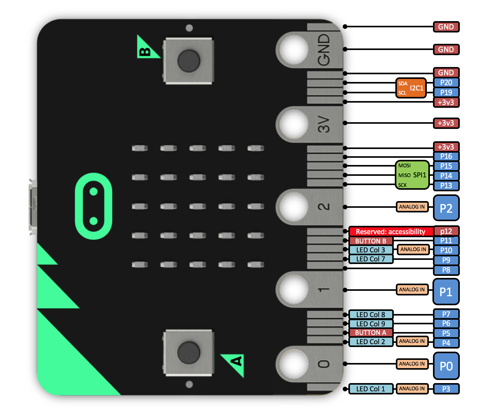

# baggybit

A picture paints a thousand words, but some words are needed.

- on the left and right hand side of the green pcb, as many big holes/connectors for crocodile clips for safe connection to i/o 
- the green area should have place for i2c and connections to left and right side big holes
- the bottom part of the green area should have the normal micro:bit connection to expansion except
 - big holes are not plated thru, ie the two sides are not connected
 - the black small connector to allow rerouting of i/o: may need two parrallel connectors with more space than jumpers
- the coin battery should be replaceable without removal of micro:bit
- the small black rectangle is a 3.5 jack for mic/speaker 
 - with routing p0: left p1: right p2: mic
 - it should be possible to disable the connections so available on outside big hole connections
- the orange area is the horizontal part of the expansion to allow for "cool things" that are not already on green board
- Kitronik buggy
 - the green board should allow rerouting of i/o so that the buggy is using digital i/o and not valuable analog i/o
 - the expansion pins on the Kitronik motor kit will be accecable for "cool things" as there is rerouting for i/o pins to the otherwise inactive backside of the motor kit
 - it is such that if the micro:bit is reversed on the motor controller, the pins are active, the green board allows for the micro:bit to be freely placed, front or back facing
- The right angled connector is optional, the green board should have big holes for "standard" bolt/nut/spacer for electrical contact of p0-2/vcc/gnd
 - The green pcb should have the possibility of mounting the right angled connector when wished

## Parts

### The Green PCB

### The Orange PCB

# Kitronik Motor Driver

The Kitronik Motor Driver is ok. However, the available i/o pins create a problem
- Motor1
 - p12: is documented as Reserved: accesiblity reasons unknown
 - p08: digital i/o
- Motor2
 - p16: digital i/o
 - p00: analog i/o ie using valuable analog i/o for a digital i/o application
- Input1
 - p01: analog i/o ie using valuable analog i/o for a digital i/o application typically the Kitronik Line follower.
- Input2:
 - p02: analog i/o ie using valuable analog i/o for a digital i/o application typically the Kitronik Line follower.
- Btn A:
 - dependant on uses, this can be ok. See below.
- Btn B:
 - dependant on uses, this can be ok. See below.

A i2c 16 digital possibility on the green pcb would allow for the following
- Motor1: application motor
 - i2c digital i/o with rerouting of signal from green pcb to appropriate pin on the bottom of the green pcb connector
 - i2c digital i/o with rerouting of signal from green pcb to appropriate pin on the bottom of the green pcb connector
- Motor2: application motor
 - i2c digital i/o with rerouting of signal from green pcb to appropriate pin on the bottom of the green pcb connector
 - i2c digital i/o with rerouting of signal from green pcb to appropriate pin on the bottom of the green pcb connector
- Input1: application Kitronik Line Follower
 - i2c digital i/o with rerouting of signal from green pcb to appropriate pin on the bottom of the green pcb connector
 - i2c digital i/o with rerouting of signal from green pcb to appropriate pin on the bottom of the green pcb connector
- Input2: application Kitronik Line Follower
 - i2c digital i/o with rerouting of signal from green pcb to appropriate pin on the bottom of the green pcb connector
 - i2c digital i/o with rerouting of signal from green pcb to appropriate pin on the bottom of the green pcb connector
- Btn A: application Ultrasonic module Trig
 - i2c digital i/o with rerouting of signal from green pcb to appropriate pin on the bottom of the green pcb connector
- Btn B: application Ultrasonic module Echo
 - i2c digital i/o with rerouting of signal from green pcb to appropriate pin on the bottom of the green pcb connector

Also, note that if connections are reroutable, access to the back pins of the motor driver are possible ("Pads only active when leds face this side")

# Micro:bit connections

The micro:bit connector documented from http://tech.microbit.org
